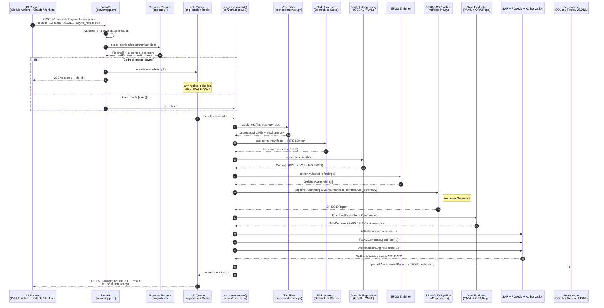
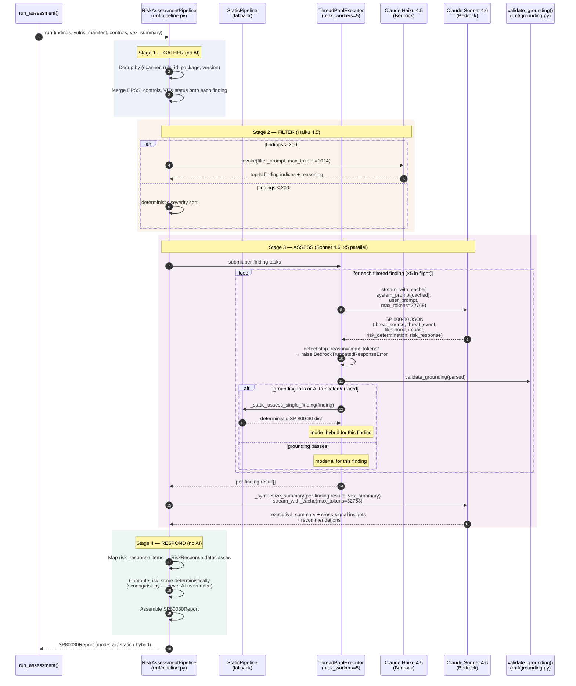

# Platform Architecture — Risk Assessment Flow

How the platform turns scanner output from a CI pipeline into a NIST SP 800-30 risk assessment, a gate decision, and an audit-ready evidence package. Focused on the sequence — not API surface, not configuration.

---

## 1. The two diagrams

- **Outer sequence** — what happens between the CI runner and the platform on a single `POST /v1/products/{name}/assess` call
- **Inner sequence** — what happens *inside* the SP 800-30 risk pipeline (4 stages, AWS Bedrock fan-out)

---

## 2. Outer sequence — CI request to evidence package

### What each step exists for

| # | Step | Why it's there |
| - | --- | --- |
| 1 | CI POST | Single integration point — one HTTP call per build |
| 2 | Parser | Normalize 9+ scanner formats into one `Finding` shape |
| 3 | Sync/async fork | Bedrock calls take minutes — must not block the CI runner |
| 4 | VEX filter | Suppress CVEs the team already triaged as `not_affected` |
| 5 | Categorize | FIPS 199 tier determines which control baseline applies |
| 6 | Baseline select | Tier → PCI / SOC 2 / ISO 27001 controls in scope |
| 7 | EPSS enrich | Real-world exploit probability per CVE |
| 8 | SP 800-30 pipeline | Per-finding risk reasoning (see Inner Sequence) |
| 9 | Gate | Deterministic PASS / BLOCK — never depends on AI |
| 10 | SAR + POA&M | Auditor evidence + remediation plan |
| 11 | Authorize | ATO / DATO decision from gate + open POA&M count |
| 12 | Persist | AssessmentRecord for delta comparison + JSONL audit trail |

---

## 3. Inner sequence — SP 800-30 risk pipeline

This is what `pipeline.run()` does. Four stages — AI participates only in stages 2 and 3.

### Why this split exists

- **Stage 1 is deterministic** because the same scanner output must always dedupe to the same threat events — that's what makes POA&M items stable across runs (so they auto-close instead of duplicating).
- **Stage 2 uses Haiku** because triaging hundreds of findings to a critical top-N is shallow reasoning where speed and cost matter more than depth.
- **Stage 3 uses Sonnet, parallelized** because per-finding SP 800-30 reasoning is the deepest cognitive work — and the only step where Claude earns its keep.
- **Stage 4 is deterministic** because the *response type* (accept / avoid / mitigate / share / transfer) and the *risk score* must be reproducible by an auditor without re-running the model.

### Failure handling

| Failure | Behavior |
| --- | --- |
| Bedrock unreachable (whole pipeline) | Fall back to `StaticRiskAssessmentPipeline` (deterministic path) |
| Bedrock fails on a single finding | Per-finding static fallback; other findings keep using AI → `mode = "hybrid"` |
| Bedrock hits `max_tokens` | `BedrockTruncatedResponseError` raised; per-finding falls back to static (prevents mid-word descriptions persisting) |
| Grounding validation rejects AI output | Same as above — per-finding static fallback |
| Rate limit hit (100 invokes/hour/pod) | `BedrockRateLimitError` raised; per-finding static fallback |

The gate decision is **always** computed from the report, regardless of which path produced each finding's analysis.

---

## 4. The hard boundary — AI is advisory, deterministic engines decide

Two things never depend on an AI call:

1. **The gate decision** (`PASS` / `BLOCK`) — computed from YAML thresholds + OPA/Rego policies against the SP 800-30 report
2. **The risk score** (0–100) — computed deterministically in `scoring/risk.py` from likelihood × impact level scores

Claude writes the *narrative*: threat-event mapping, MITRE ATT&CK technique, likelihood/impact evidence, business-impact rationale, recommended response. Claude never writes the score or the gate verdict.

This is what makes the output legally defensible — an auditor can reproduce the gate decision and the numeric score from the raw findings + YAML config alone. The AI's contribution is the *why*.

---

## 5. Where the durable artifacts come from

After `run_assessment()` returns, three files are written to disk and S3 (via the dashboard publisher):

| Artifact | Generated by | Used for |
| --- | --- | --- |
| **`sp800-30.json`** | `SP80030Report` from `pipeline.run()` | Auditor read-out, dashboard render |
| **`sar.json`** | `SARGenerator.generate()` | Per-control assessment evidence |
| **`poam.json`** | `POAMGenerator.generate()` | Remediation tickets, auto-closes on next run |
| **`authorization.json`** | `AuthorizationEngine.decide()` | ATO / DATO record |
| **`evidence/*.jsonl`** | `evidence/jsonl.py` | Append-only audit trail |

These are the same artifacts a NIST-aligned federal authorization process would produce — generated automatically per build.
